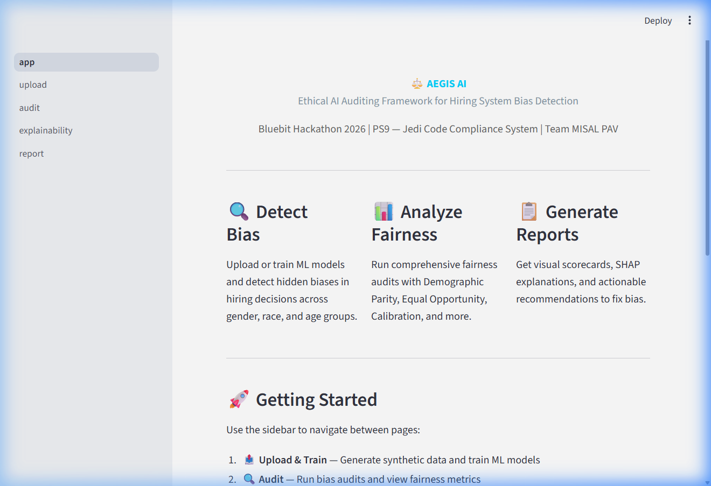
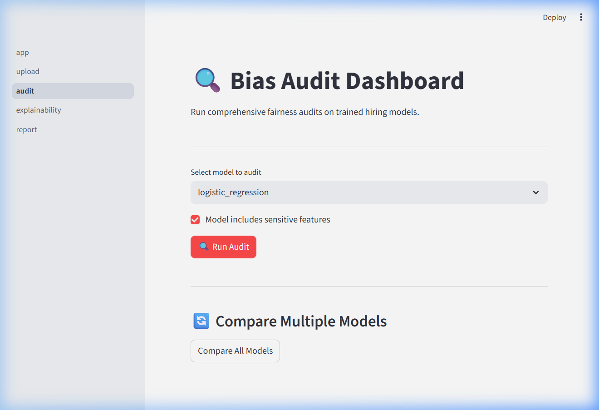
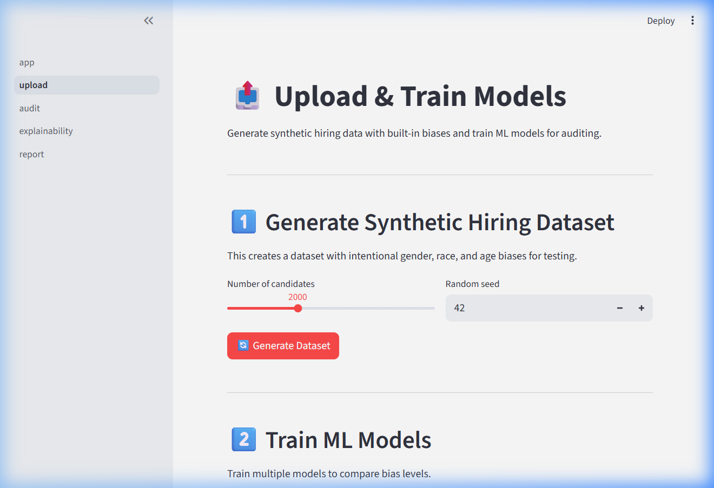
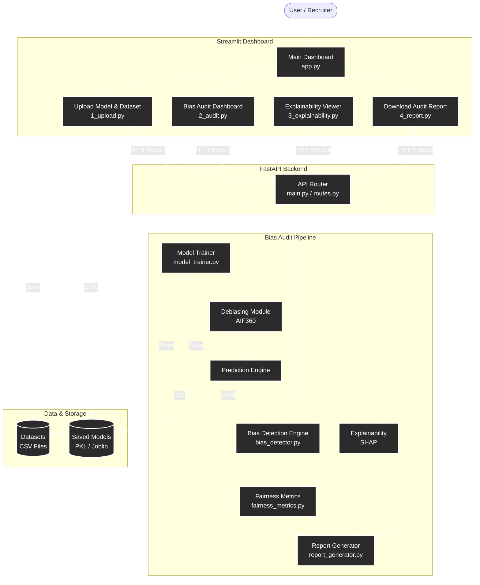
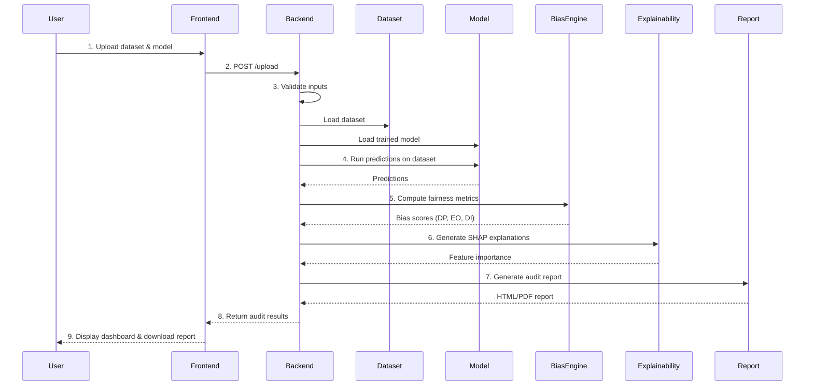
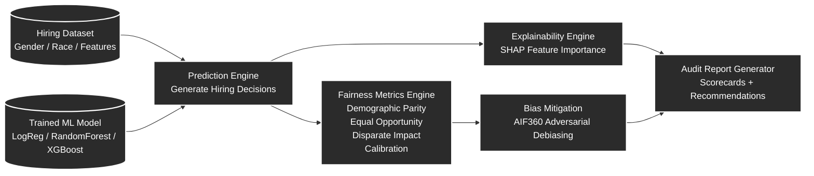

# ⚖️ AEGIS AI — AI Ethics Governance & Integrity System 

### Ethical AI Auditing Framework for Hiring System Bias Detection

> **Bluebit 4.0 Hackathon 2026 | Problem Statement 9 (PS9)**
> **Team: MISAL PAV**

---

## 🎯 Problem Statement

AI-powered hiring systems can inadvertently encode and amplify biases related to gender, race, age, and other protected attributes. AEGIS AI is an **Ethical AI Auditing Framework** that detects, quantifies, and explains bias in hiring ML models, providing actionable recommendations for improvement.

## 📸 Screenshots

| Dashboard Home | Bias Audit | Upload & Train |
|---|---|---|
|  |  |  |

## 🏗️ System Architecture



## 🔄 Analysis Workflow

The following sequence diagram shows how **AEGIS AI performs a bias audit on a hiring model**, from dataset upload to final report generation.



## ✨ Key Features

### Mandatory Deliverables ✅
- **Hiring System Bias Audit** — Detects gender and race bias in ML hiring models
- **Ethical Testing Suite** — Implements:
  - Demographic Parity (equal outcomes across groups)
  - Equal Opportunity (equal true positive rates)
  - Calibration (confidence matches reality)
  - Privacy Preservation checks
  - Transparency/Interpretability scoring
- **Explainability Engine** — SHAP-based feature importance + decision explanations
- **Visual Reporting** — Pass/fail scorecard, bias instance highlighting, improvement recommendations

### Bonus Features 🌟
- Multiple AI model comparison (Logistic Regression, Random Forest, XGBoost)
- **Adversarial Debiasing** (AIF360) — In-processing bias mitigation with GPU acceleration
- Automated testing pipeline (39/39 tests passing)
- HTML audit report generation with visual scorecards
- Real recruitment dataset support (`dataset/data.csv`)

## 🧠 Bias Detection ML Pipeline

The AEGIS AI auditing engine evaluates machine learning hiring models through a structured bias detection pipeline.  
The system generates predictions, computes fairness metrics across protected groups, explains model behavior, and produces an interpretable audit report.



## 🛠️ Tech Stack

| Component | Technology |
|-----------|-----------|
| **Frontend** | Streamlit |
| **Backend** | FastAPI + Python |
| **ML Models** | Scikit-learn, XGBoost |
| **Explainability** | SHAP |
| **Debiasing** | AIF360 (Adversarial Debiasing) |
| **Visualization** | Plotly, Matplotlib, Seaborn |
| **Report Generation** | Jinja2 + HTML/CSS |
| **Data Processing** | Pandas, NumPy |
| **GPU Acceleration** | TensorFlow + CUDA (RTX 4060) |

## 📁 Project Structure

```
bluebit/
├── README.md
├── requirements.txt
├── setup.py
├── .gitignore
│
├── backend/                    # FastAPI Backend
│   ├── __init__.py
│   ├── main.py                 # FastAPI app entry point
│   ├── api/
│   │   ├── __init__.py
│   │   ├── routes.py           # API endpoints
│   │   └── schemas.py          # Pydantic models
│   └── config.py               # Configuration
│
├── core/                       # Core Bias Detection Engine
│   ├── __init__.py
│   ├── bias_detector.py        # Main bias detection logic
│   ├── fairness_metrics.py     # Demographic parity, equal opportunity, etc.
│   ├── explainability.py       # SHAP explanations
│   ├── model_trainer.py        # Train biased models for testing
│   ├── report_generator.py     # Generate audit reports
│   └── utils.py                # Helper functions
│
├── data/                       # Data files
│   ├── synthetic_hiring_data.csv
│   └── generate_data.py        # Script to generate synthetic data
│
├── models/                     # Saved ML models
│   └── .gitkeep
│
├── frontend/                   # Streamlit Dashboard
│   ├── app.py                  # Main Streamlit app
│   ├── pages/
│   │   ├── 1_upload.py         # Upload model & dataset
│   │   ├── 2_audit.py          # Run audit & view results
│   │   ├── 3_explainability.py # SHAP visualizations
│   │   └── 4_report.py         # Download report
│   └── assets/
│       └── style.css           # Custom styling
│
├── tests/                      # Testing suite
│   ├── __init__.py
│   ├── test_bias_detector.py   # Unit tests for bias detection
│   ├── test_fairness_metrics.py# Tests for fairness metrics
│   ├── test_api.py             # API endpoint tests
│   └── test_results/           # Test results & evidence
│       └── .gitkeep
│
├── docs/                       # Documentation
│   ├── testing_methodology.md  # Testing approach documentation
│   ├── algorithm_explanation.md# Detection algorithm explanation
│   └── screenshots/            # Screenshots for README
│       └── .gitkeep
│
└── notebooks/                  # Jupyter notebooks (exploration)
    └── exploration.ipynb
```

## 🚀 Quick Start

### Prerequisites
- Python 3.9+
- pip

### Installation

```bash
# Clone the repository
git clone https://github.com/lucifer0906/bluebit.git
cd bluebit

# Create virtual environment
python -m venv venv
source venv/bin/activate    # Linux/Mac
venv\Scripts\activate       # Windows

# Install dependencies
pip install -r requirements.txt
```

### Generate Synthetic Data
```bash
python data/generate_data.py
```

### Train Models
```bash
python -c "from core.model_trainer import train_all_models; train_all_models()"
```

### Run Backend API
```bash
uvicorn backend.main:app --reload --port 8000
```

### Run Frontend Dashboard
```bash
streamlit run frontend/app.py
```

## 📊 Fairness Metrics Implemented

| Metric | Description | Threshold |
|--------|-------------|-----------|
| **Demographic Parity** | Equal selection rates across groups | Ratio > 0.8 |
| **Equal Opportunity** | Equal true positive rates | Difference < 0.1 |
| **Calibration** | Predicted probabilities match actual outcomes | Brier score < 0.25 |
| **Disparate Impact** | 4/5ths rule compliance | Ratio > 0.8 |
| **Transparency Score** | Model interpretability rating | Score > 60/100 |

## 🧪 Testing

```bash
# Run all tests
python -m pytest tests/ -v

# Run with coverage
python -m pytest tests/ --cov=core --cov-report=html
```

### Test Evidence
- 20+ test cases covering bias detection across gender and race
- Accuracy metrics documented in `tests/test_results/`
- Sample inputs and outputs provided

## 📹 Demo Video

[Link to Demo Video](https://drive.google.com/file/d/16yVeFs8Fw2Tguo1vFO34SvmiivSgIuZk/view?usp=sharing)

## 👥 Team — MISAL PAV

| Name | Role |
|------|------|
| Akshay Manbhaw | Backend & ML |
| Gaurav Tiple | ML & Visualization + Presentation |
| Chetan Shelar | Testing & Documentation |

## 📄 License

This project was built during the Bluebit 4.0 Hackathon 2026 (March 8, 2026).
